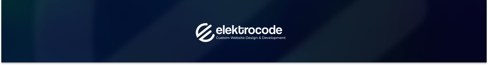

<p align="center"></p>

# :cookie: Elektrocode Cookies Manager :cookie:

This manager is developed to act as an informational banner only. It does not have any functionality to reject cookies.
Once accepted it creates cookie that is being checked and if it exists cookiesManager is not shown again.

You can open our <a href="https://elektrocode.com/">website</a> to check it out!

<!-- TOC -->

* [Installation](#installation)
* [Usage](#usage)
* [Customizations](#customizations)
    * [CookiesManager's cookie name](#cookiesmanagers-cookie-name)
    * [Theme :sunny: / :crescent_moon:](#theme-sunny--crescentmoon)
    * [Image / Icon](#image--icon)
    * [Text and information](#text-and-information)
    * [Button labels](#button-labels)
    * ["More Info" popup](#more-info-popup)

<!-- TOC -->

## Installation

```
    npm install elektrocode-cookies-manager
```

## Usage

```vue
//Layout.vue

<script setup>
import CookiesManager from 'elektrocode-cookies-manager';
import 'elektrocode-cookies-manager/dist/index.css';
</script>

<template>
    <slot/>
    <CookiesManager/>
</template>
```

## Customizations

### CookiesManager's cookie name

By default, the cookie is called ```elektrocode_cookies_popup```. To change that use ```cookieName``` prop.

```vue

<CookiesManager cookieName="my_new_cookie_name"/>
```

### Theme :sunny: / :crescent_moon:

- :sunny: Light theme is the default.
  Check it out :eyes: :eyes:

|  |  |
|:-----------------------------:|:---------------------------------------------------:|

- :crescent_moon: Dark theme
    - use the ```dark``` prop to activate

```vue

<CookiesManager dark/>
```

|  |  |
|:---------------------------:|:-------------------------------------------------:|

### Image / Icon

By default, CookiesManager popup comes without image or icon.
You can set one with the ```image``` prop.

```vue
<!-- you can use saved image -->
<CookiesManager :image="CookieSvg"/>

<!-- or you can use url -->
<CookiesManager image="{image url}"/>
```

### Text and information

CookiesManager comes with default title and description of the popup,
but you can change it anytime using ```title``` and ```description``` props.
They accept strings as values.

### Button labels

If button labels are not to your taste you can easily change that.

| prop name                     | default value | 
|:------------------------------|:-------------:|
| acceptCookieButtonLabel       |    Accept     |
| moreInfoButtonLabel           |   More info   |
| closeMoreInfoPopupButtonLabel |     Close     |

### "More Info" popup

"More Info" popup is designed to provide additional information
and explanation of the cookies that are being used in the website.
This information needs to be provided by you in the ```cookiesInfo``` prop.
If no this is not provided, cookiesManager will not show the **More info** button.

```cookiesInfo``` prop accepts **array of object**.
Each object is separate section inside the "More info" popup and should have this build:

```
   {
        name: '...',
        description: '...',
        cookies: [
            {
                key: 'XSRF-TOKEN',
                description: '...'
            },
            {
                ...
            },
            ...
        ]
    }
```

Preview:

|  |  |
|-------------------------------------------|-----------------------------------------|


